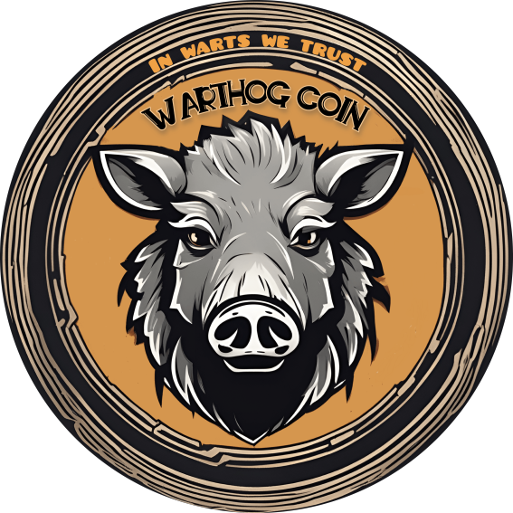
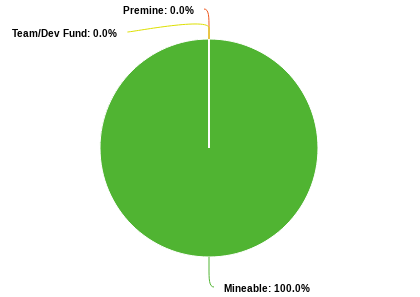

WARTHOG REFERENCE IMPLEMENTATION
Copyright (c) 2023 Pumbaa, Timon & Rafiki

  

# 🐗 Warthog Reference Implementation

Welcome to Warthog!

Warthog is an experimental L1-cryptocurrency implementation without
specific focus. Don't take this project seriously, it is just 
our hobby experiment. This project is not a dumb fork of something else. It was developed completely from scratch! 

## 💵 Tokenomics
We are a cryptocurrency for the community where everyone can revive again the good old days when crypto was fun. Therefore we have decided to be free of 💩bullshit:
- 👍 No Premine
- 🤟 No Team/Dev fund
- 😊 100% of supply is publicly mineable

  

The block chain has the following characteristics:
- 1️⃣  Coin unit: 1 WART
- ⏲  Block time: 20s
- 💰 Initial block reward: 3 WART
- 🧮 Precision: 0.00000001 WART (8 digits)
- 🔪 Halving: ~ every 2 years
- 🔒 Supply hard cap : 18921599.68464 (~19m) WART

## 💣 A word of caution
But beware of bugs: Here be dragons. Almost everything was 
implemented from scratch. We are no experts so don't expect this
software to be rock solid, and don't even expect things to work 
properly. Use at your own risk. There may be and almost 
certainly are serious bugs! You have been warned.

Have fun with it. Like we had implementing it.

## 📢 Socials

<a href="https://discord.gg/QMDV8bGTdQ"> Discord </a>
| 
<a href="https://t.me/warthognetwork"> Telegram </a>
| 
 <a href="https://bitcointalk.org/index.php?topic=5458046.0">  Bitcointalk</a>
 |
 <a href="http://warthog.network">🌐 Website</a>

## 💱 Where to buy?
Not listed yet. At the moment only p2p on Discord. 

## 📦 What is in the box?

* Reference node implementation of the Warthog Network
* Command line wallet software
* CPU Miner
* GPU Miner

## 💻 System Requirements

* Linux
* gcc11 or newer
* meson
* ninja

Optional:
* opencl (for GPU miner)

Note: Ubuntu 20.04 does not meet these requirements.

## 😵‍💫 BUILD INSTRUCTIONS

* Install gcc, meson, ninja: apt install meson ninja-build build-essential
* Clone the repo: `git clone https://github.com/ByPumbaa/Warthog`
* cd into the repo: `cd Warthog`
* Create build directory: `meson build .` (`meson build . --buildtype=release` for better performance)
* cd into build directory: `cd build`
* [Optional] GPU miner support 
  - enable GPU support in miner: `meson configure -Denable-gpu-miner=true`
  - for old OpenCL headers (like on Ubuntu 20.04): `meson configure -Dopencl-legacy=true`
* Compile using ninja: `ninja`

### Docker build (node and wallet)

#### Build for Linux
* Run `DOCKER_BUILDKIT=1 docker build . --output build` in the repo directory.
#### Build for Windows (cross-compilation on Linux)
* Run `DOCKER_BUILDKIT=1 docker build . -f DockerfileWindows --output ./build/windows` in the repo.
* Windows binaries are located in `./build/windows` directory.

## ▶️ USAGE

* Linux only at the moment
* Compile with meson/ninja
* Run the node (use some restarter in case it crashes)
* Run the miner (compile with release build type for performance)
* Optional: Run the wallet to send funds.
* Good luck and have fun! Use --help the option.

NOTE: We (or some of us) might drop this project any time in case 
      deep/unfixable bugs or ugly design issues arise. Or without
      any reason and without prior notice. 

## 📖 Documentation
* [API Reference](./doc/API.md)
* [Python Integration Guide](./doc/integration_python.md)
* [Elixir Integration Guide](./doc/integration_elixir.md)
* [Nodejs Integration Guide](./doc/integration_nodejs.md)

## ⛏ Upcoming Mining algorithm
 * NEWS: Custom [Janushash algorithm](./doc/janushash.md) in the works. First Proof of Balanced Work mining algorithm in the world.

