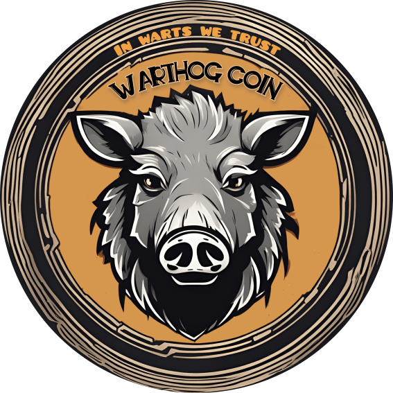

[](https://github.com/warthog-network/core/actions/workflows/release-defi.yml)
[](https://github.com/warthog-network/core/releases)
[](LICENSE)
[](https://en.cppreference.com/w/cpp/23)
[](https://hub.docker.com/r/zzjulien/warthog_node)

<p align="center">
  
</p>

# 🐗 Warthog Reference Implementation — defi branch

**The world's first Proof of Balanced Work cryptocurrency, with native DeFi powered by Fair Batch Matching.**

Warthog is an experimental cryptocurrency (a fresh rewrite, not a fork) that pushes the boundaries of what is possible in crypto. The defi branch adds native DeFi features — token creation, decentralized exchange, liquidity pools, and the revolutionary Fair Batch Matching algorithm — on top of the mainnet `master` branch.

Copyright (c) 2023-2026 Pumbaa, Rafiki & CoinFuMasterShifu

## 🚀 Status

This is the **defi branch** of the Warthog reference implementation. It is currently in **testnet** phase and adds the following on top of the mainnet `master` branch:

- Native DeFi: token creation, limit orders, liquidity pools, automatic WART pools per asset
- Fair Batch Matching (FBM) — the sandwich-proof DEX matching algorithm
- New implicit transactions: `reward`, `match`
- TUI wallet (replaces the master-branch CLI wallet)

See [HUB.md](../../HUB.md) for full project state.

## ⚡ Revolutionary Features

### 🛡️ Fair Batch Matching (FBM)

Warthog's DEX uses **Fair Batch Matching**, a novel matching algorithm that eliminates sandwich attacks and MEV extraction by processing all swap orders *jointly* within a block. Every participant receives identical pricing regardless of transaction sequence, establishing a Nash equilibrium where manipulation is mathematically impossible.

- **Live demo**: [warthog.network/defi-demo](https://warthog.network/defi-demo)
- **Mathematical foundation**: [FairBatchMatching.pdf](https://warthog.network/FairBatchMatching.pdf)
- **Accessible explanation**: [docs/unique-features/hard-coded-defi/fair-batch-matching.md](https://github.com/warthog-network/docs/blob/main/unique-features/hard-coded-defi/fair-batch-matching.md)

### ⛏️ Janushash — World's First Proof of Balanced Work

Warthog uses **Janushash**, the first Proof of Balanced Work (PoBW) mining algorithm. Janushash multiplicatively combines **Sha256t** (GPU) and **Verushash v2.2** (CPU). Efficient mining requires both, which brings mining closer to Satoshi's original "one computer, one vote" vision than any other cryptocurrency.

- **PoBW paper**: [PoBW.pdf](https://warthog.network/PoBW.pdf)
- **Janushash docs**: [docs.warthog.network/janushash](https://docs.warthog.network/janushash/)
- **Original paper repo**: [CoinFuMasterShifu/ProofOfBalancedWork](https://github.com/CoinFuMasterShifu/ProofOfBalancedWork)

### 🧵 Thread-Based Block Sync

Unlike traditional cryptocurrencies where blocks are identified and downloaded by hash, Warthog uses a thread-based approach. A blockchain with possible forks is a tree; by implementing a branch-aware sync algorithm, blocks can be addressed by height and branch. This shrinks communication message size, improves latency for distributing new blocks, and makes sync faster. Nodes are also aware of the sync state of peers. To the best of our knowledge, Warthog is the first cryptocurrency to implement this approach.

### 🌐 Browser-Based Full Nodes (planned)

Warthog is the first cryptocurrency with nodes that can run entirely in the browser. This lowers the barrier of setting up a node to as low as opening a website — even on smartphones — and improves decentralization since these are full nodes. **Status: on the roadmap but currently on hold (DeFi has top priority).**

## 💵 Tokenomics

- 👍 No premine
- 🤟 No team/dev fund
- 😊 100% of supply is publicly mineable
- ⏲ Block time: 20 seconds
- 💰 Initial block reward: 3 WART
- 🧮 Precision: 0.00000001 WART (8 digits)
- 🔪 Halving: every ~2 years
- 🔒 Supply hard cap: 18,921,599.68464 WART (~19 million)

## 🛒 Where to Buy

- [CoinEx](https://www.coinex.com/en/exchange/WART-USDT)
- [Bitcointry](https://bitcointry.com/en/exchange/WART_USDT) (US traders allowed)
- [Safetrade](https://safetrade.com/exchange/WART-USDT)

## 💻 Installation

### Quick start with `just`

If you have [`just`](https://github.com/casey/just#installation) installed:

```bash
just build-linux      # Build Linux executables via Docker, outputs to build/
just build-windows    # Cross-compile for Windows via Docker, outputs to build/windows/
just run_debug        # Run debug Docker image (for valgrind)
just valgrind -- [args]   # Run valgrind; args after -- go to warthog
just bump             # Bump patch version in meson.build
```

### Linux native build

System requirements: Linux, gcc11 or newer, meson, ninja.

```bash
sudo apt install meson ninja-build build-essential
git clone https://github.com/warthog-network/core
cd core
meson setup build --buildtype=release
cd build
ninja
```

### Docker build (node and wallet)

System requirements: Linux, Docker.

```bash
# Linux
DOCKER_BUILDKIT=1 docker build . -f dockerfiles/build_linux --output build

# Windows (cross-compilation on Linux)
DOCKER_BUILDKIT=1 docker build . -f dockerfiles/build_windows --output ./build/windows

# macOS aarch64 (cross-compilation on Linux) — currently broken
DOCKER_BUILDKIT=1 docker build . -f dockerfiles/build_macos --output ./build/macos
```

## ▶️ Usage

```bash
# Run the node (use a restarter in case it crashes)
screen -dmS wart_node bash -c "while true; do ./wart-node-linux; done"
screen -r wart_node  # to see output, CTRL+A+D to detach
```

For public RPC mode (exposes a filtered subset of the API on port 3001):

```bash
./wart-node-linux --enable-public
```

See [docs/developers/api/rest.md](https://github.com/warthog-network/docs/blob/main/developers/api/rest.md#public-rpc-mode) for details on which endpoints are filtered.

For solo mining, enable stratum on the node:

```bash
./wart-node-linux --stratum=0.0.0.0:3456
```

Then point your miner (e.g. [bzminer](https://www.bzminer.com/) or [janusminer](https://github.com/CoinFuMasterShifu/janusminer)) at `stratum+tcp://your-node-ip:3456`.

For wallet interaction, use the TUI wallet built from `src/tui_wallet/`.

Use `--help` to see all available options.

## 📖 Documentation

- [Project documentation](https://docs.warthog.network/)
- [API reference](https://docs.warthog.network/developers/api/)
- [Wallet integration guide](https://docs.warthog.network/developers/integration/wallets.md)
- [Pool integration guide](https://docs.warthog.network/developers/integration/pools/stratum.md)
- [Miner integration guide](https://docs.warthog.network/developers/integration/miners.md)
- [Janushash algorithm](https://docs.warthog.network/janushash/)
- [Project whitepaper](https://warthog.network/whitepaper.pdf)
- [PoBW research paper](https://warthog.network/PoBW.pdf)
- [Fair Batch Matching paper](https://warthog.network/FairBatchMatching.pdf)
- [DeFi live demo](https://warthog.network/defi-demo)

## 🤝 Contributing

Everyone is welcome to contribute. Please see the [project documentation](https://docs.warthog.network/) and feel free to open issues or pull requests on GitHub.

## ⚠️ Disclaimer

This is highly experimental software. Almost everything was implemented from scratch. There may be bugs. Use at your own risk.

This project is not backed by any institution or foundation. It relies on the work of volunteers who have no obligation to do work for the project. People can join and leave any time at their will.

## 📢 Community

- [Discord](https://discord.com/invite/QMDV8bGTdQ) — most active, ask here for support
- [Telegram](https://t.me/warthognetwork)
- [Bitcointalk](https://bitcointalk.org/index.php?topic=5458046.0)
- [Website](https://warthog.network)

## License

[MIT License](LICENSE)
